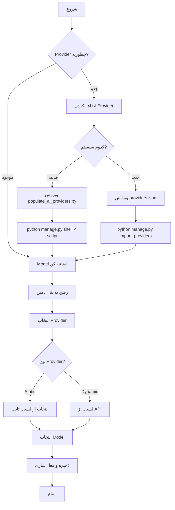

# 📘 راهنمای کامل: اضافه کردن Provider و Model

## 🎯 سیستم فعلی شما چطور کار می‌کنه؟

شما **دو سیستم** دارید که **هر دو** می‌تونند استفاده بشن:

### 1️⃣ **سیستم قدیمی** (موجود)
- ✅ فایل: `scripts/populate_ai_providers.py`
- ✅ فقط **Provider** ها رو اضافه می‌کنه
- ✅ **Model** ها باید از پنل ادمین یا API انتخاب بشن

### 2️⃣ **سیستم جدید** (که ساختیم)
- ✅ فایل: `config/providers.json`
- ✅ Management Command: `import_providers.py`
- ✅ Unified Dashboard API
- ✅ Auto-discovery از JSON

---

## 📋 جدول مقایسه

| ویژگی | سیستم قدیمی | سیستم جدید | توصیه |
|------|------------|------------|-------|
| **نحوه اضافه کردن Provider** | ویرایش Python script | ویرایش JSON file | JSON راحت‌تر |
| **اجرا** | `python manage.py shell < scripts/populate_ai_providers.py` | `python manage.py import_providers` | هر دو |
| **نحوه اضافه کردن Model** | از پنل ادمین | از پنل ادمین | یکسان |
| **Scalability** | متوسط | عالی | JSON |
| **Maintenance** | سخت‌تر (Python) | آسان‌تر (JSON) | JSON |

---

## 🚀 راهنمای گام‌به‌گام

### ✅ اضافه کردن Provider جدید

#### مرحله 1: اضافه کردن Provider جدید

```python
# ویرایش: scripts/populate_ai_providers.py

def populate_providers():
    providers_data = [
        # ... Providerهای موجود
        
        # ✅ اضافه کردن Provider جدید
        {
            'name': 'Anthropic',
            'slug': 'anthropic',
            'display_name': 'Anthropic Claude',
            'website': 'https://anthropic.com',
            'api_base_url': 'https://api.anthropic.com/v1',
            'description': 'Claude 3.5 Sonnet - بهترین برای کدنویسی',
            'allow_personal_keys': True,
            'allow_shared_for_normal_admins': False,
            'is_active': True,
            'sort_order': 7,  # ترتیب نمایش
        },
    ]
    # ... بقیه کد
```

#### مرحله 2: اجرای Script

```bash
# روش 1: با shell
python manage.py shell < scripts/populate_ai_providers.py

# روش 2: با runscript (اگر django-extensions داری)
python manage.py runscript populate_ai_providers
```

**خروجی:**
```
============================================================
🚀 Populating AI Providers and Models
============================================================

📦 Step 1: Creating/Updating Providers...
✅ Created: OpenAI (ChatGPT, DALL-E)
✅ Created: Google Gemini
...
✅ Created: Anthropic Claude  ← جدید!

============================================================
✅ DONE!
   Providers: 7 created, 0 updated, 0 deactivated
============================================================
```

---

### ✅ روش 2: استفاده از سیستم جدید (JSON Config) - **توصیه می‌شه**

#### مرحله 1: اضافه کردن به JSON

```json
// ویرایش: src/ai/config/providers.json

{
  "version": "1.0.0",
  "providers": [
    // ... Providerهای موجود
    
    // ✅ اضافه کردن Provider جدید
    {
      "slug": "anthropic",
      "name": "Anthropic",
      "display_name": "Anthropic Claude",
      "description": "Claude 3.5 Sonnet - بهترین برای کدنویسی و تحلیل",
      "provider_class": "src.ai.providers.anthropic.AnthropicProvider",
      "api_base_url": "https://api.anthropic.com/v1",
      "website": "https://www.anthropic.com",
      "logo_url": "https://www.anthropic.com/favicon.ico",
      "documentation_url": "https://docs.anthropic.com",
      "capabilities": {
        "chat": {
          "supported": true,
          "has_dynamic_models": false,
          "description": "Claude 3.5 Sonnet, Claude 3 Opus",
          "models": [
            "claude-3-5-sonnet-20241022",
            "claude-3-opus-20240229",
            "claude-3-haiku-20240307"
          ]
        },
        "content": {
          "supported": true,
          "has_dynamic_models": false,
          "description": "تولید محتوا با Claude"
        },
        "image": {
          "supported": false
        },
        "audio": {
          "supported": false
        }
      },
      "config": {
        "supports_streaming": true,
        "max_retry": 3,
        "timeout": 60
      },
      "pricing_info": {
        "type": "pay_per_use",
        "minimum_credit": 5,
        "free_tier": false
      },
      "sort_order": 7,
      "is_active": true,
      "is_recommended": true
    }
  ]
}
```

#### مرحله 2: Import به Database

```bash
# بررسی اول (بدون تغییر)
python manage.py import_providers --dry-run

# Import همه
python manage.py import_providers

# فقط یک Provider
python manage.py import_providers --slug anthropic

# Force update (اگه قبلاً وجود داره)
python manage.py import_providers --slug anthropic --force
```

**خروجی:**
```
📦 Found 7 provider(s) to import
✅ Created: OpenRouter (60+ Providers) (openrouter)
✅ Created: OpenAI (Official) (openai)
✅ Created: Anthropic Claude (anthropic)  ← جدید!
...
════════════════════════════════════════════════════════════
📊 Import Summary:
  ✅ Created: 7
  🔄 Updated: 0
  ⏭️  Skipped: 0
════════════════════════════════════════════════════════════
```

---

## 🎨 اضافه کردن Model

**هر دو سیستم یکسان هستند!** مدل‌ها از پنل ادمین یا API اضافه می‌شن.

### روش 1: از پنل ادمین (Next.js)

#### گام 1: دریافت لیست Model های موجود

```typescript
// در Frontend
const response = await fetchApi.get(
  '/api/admin/ai-models/browse-models/?provider=anthropic&capability=chat'
)

// Response:
{
  "provider": "anthropic",
  "capability": "chat",
  "models": [
    {
      "id": "claude-3-5-sonnet-20241022",
      "name": "Claude 3.5 Sonnet",
      "is_free": false,
      "pricing": {...}
    }
  ]
}
```

#### گام 2: انتخاب و ذخیره Model

```typescript
// انتخاب مدل
const response = await fetchApi.post('/api/admin/ai-models/select-model/', {
  provider: 'anthropic',
  capability: 'chat',
  model_id: 'claude-3-5-sonnet-20241022',
  model_name: 'Claude 3.5 Sonnet',
  is_free: false
})

// این کار:
// 1. مدل رو در دیتابیس ذخیره می‌کنه
// 2. مدل قبلی برای این capability رو غیرفعال می‌کنه
// 3. فقط یک مدل فعال برای هر provider+capability
```

### روش 2: از API مستقیم (cURL/Postman)

```bash
# دریافت لیست مدل‌ها
curl -X GET "http://localhost:8000/api/admin/ai-models/browse-models/?provider=anthropic&capability=chat" \
  -H "Cookie: admin_session_id=..."

# انتخاب مدل
curl -X POST "http://localhost:8000/api/admin/ai-models/select-model/" \
  -H "Content-Type: application/json" \
  -H "Cookie: admin_session_id=..." \
  -d '{
    "provider": "anthropic",
    "capability": "chat",
    "model_id": "claude-3-5-sonnet-20241022",
    "model_name": "Claude 3.5 Sonnet",
    "is_free": false
  }'
```

---

## 📊 جدول API Endpoints

| عملیات | Endpoint | Method | توضیح |
|--------|----------|--------|-------|
| **لیست Providers** | `/api/admin/ai-providers/` | GET | همه providers |
| **لیست Model ها** | `/api/admin/ai-models/` | GET | مدل‌های انتخاب شده |
| **Browse Model ها** | `/api/admin/ai-models/browse-models/` | GET | مدل‌های موجود یک provider |
| **انتخاب Model** | `/api/admin/ai-models/select-model/` | POST | ذخیره مدل انتخابی |
| **Dashboard کامل** | `/api/admin/ai/dashboard/overview/` | GET | همه چیز یکجا ⭐ |

---

## 🔍 Provider Types

### 1️⃣ **Static Providers** (مدل‌های ثابت)

مدل‌هایشون در `capabilities.json` یا همین جا تعریف شده:

- ✅ **OpenAI**: GPT-4o, GPT-4 Turbo, DALL-E 3
- ✅ **Google**: Gemini 2.0 Flash, Gemini Pro
- ✅ **DeepSeek**: DeepSeek R1, V3
- ✅ **Anthropic**: Claude 3.5 Sonnet, Opus

**نحوه کار:**
1. Admin به پنل می‌ره
2. Provider رو انتخاب می‌کنه
3. لیست مدل‌ها (از capabilities) نمایش داده میشه
4. یک مدل رو انتخاب و فعال می‌کنه

### 2️⃣ **Dynamic Providers** (مدل‌های پویا)

مدل‌هایشون از API دریافت میشه:

- ✅ **OpenRouter**: 400+ مدل از 60+ provider
- ✅ **Groq**: مدل‌های سریع و رایگان
- ✅ **HuggingFace**: هزاران مدل Open Source

**نحوه کار:**
1. Admin API Key رو تنظیم می‌کنه
2. سیستم مدل‌ها رو از API می‌گیره (با cache)
3. لیست مدل‌های Real-time نمایش داده میشه
4. Admin انتخاب می‌کنه و فعال می‌کنه

---

## 🎯 Workflow کامل



---

## 💡 مثال‌های عملی

### مثال 1: اضافه کردن Cohere

#### JSON (توصیه می‌شه):

```json
{
  "slug": "cohere",
  "name": "Cohere",
  "display_name": "Cohere AI",
  "provider_class": "src.ai.providers.cohere.CohereProvider",
  "capabilities": {
    "chat": {
      "supported": true,
      "has_dynamic_models": false,
      "models": ["command-r", "command-r-plus"]
    }
  },
  "sort_order": 8
}
```

```bash
python manage.py import_providers --slug cohere
```

#### Python Script:

```python
# در populate_ai_providers.py
{
    'name': 'Cohere',
    'slug': 'cohere',
    'display_name': 'Cohere AI',
    'api_base_url': 'https://api.cohere.ai/v1',
    'sort_order': 8,
}
```

```bash
python manage.py shell < scripts/populate_ai_providers.py
```

### مثال 2: اضافه کردن Model برای Provider موجود

فرض کن OpenAI یک مدل جدید داره: `gpt-4.5`

```typescript
// در Frontend
const response = await fetchApi.post('/api/admin/ai-models/select-model/', {
  provider: 'openai',
  capability: 'chat',
  model_id: 'gpt-4.5',
  model_name: 'GPT-4.5 Ultra',
  is_free: false
})
```

**یا** اگه Static Provider هست:

```json
// در providers.json
"capabilities": {
  "chat": {
    "models": [
      "gpt-4o",
      "gpt-4.5",  ← اضافه کن
      "gpt-3.5-turbo"
    ]
  }
}
```

---

## ⚠️ نکات مهم

### 1. فقط یک Model فعال

```python
# سیستم خودکار این کار رو می‌کنه
# وقتی مدل جدید انتخاب میشه، مدل قبلی همون capability غیرفعال میشه

AIModel.objects.filter(
    provider=provider,
    capability='chat',
    is_active=True
).exclude(pk=new_model.pk).update(is_active=False)
```

### 2. Provider Class باید وجود داشته باشه

```python
# اگه provider_class رو تعریف کردی، باید فایل وجود داشته باشه
# src/ai/providers/anthropic.py

class AnthropicProvider(BaseProvider):
    def __init__(self, api_key: str, config: dict = None):
        super().__init__(api_key, config)
    
    # ... implementation
```

### 3. Cache Management

```bash
# بعد از اضافه کردن Provider یا Model جدید:
curl -X POST "http://localhost:8000/api/admin/ai/dashboard/cache/clear/"
```

---

## 🤔 توصیه نهایی

**استفاده از Python Script** چون:
- ⚡ **سریع‌تر**: بدون overhead JSON parsing
- 📍 **ساده‌تر**: یک فایل Python ساده
- 📈 **کافی**: چند تا provider داریم (نه 100+)
- 🧹 **کد کمتر**: بدون لایه‌های اضافی

---

## 📚 خلاصه دستورات

```bash
# ══════════════════════════════════════════════════════════
# سیستم قدیمی (Python Script)
# ══════════════════════════════════════════════════════════

# اجرای script
python manage.py shell < scripts/populate_ai_providers.py

# یا با runscript
python manage.py runscript populate_ai_providers


# ══════════════════════════════════════════════════════════
# سیستم جدید (JSON Config)
# ══════════════════════════════════════════════════════════

# بررسی (dry-run)
python manage.py import_providers --dry-run

# Import همه
python manage.py import_providers

# Import یک Provider خاص
python manage.py import_providers --slug anthropic

# Force update
python manage.py import_providers --force

# Import یک Provider خاص با force
python manage.py import_providers --slug openrouter --force


# ══════════════════════════════════════════════════════════
# پاک کردن Cache
# ══════════════════════════════════════════════════════════

curl -X POST "http://localhost:8000/api/admin/ai/dashboard/cache/clear/" \
  -H "Cookie: admin_session_id=..."
```

---

**✅ حالا می‌دونی چطور Provider و Model اضافه کنی!** 🚀
